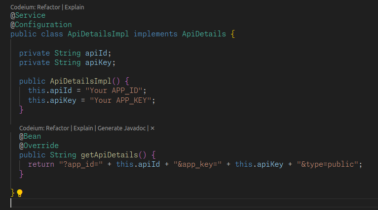

## Using API Details for the Backend Application

### API Details

With Spring Boot, there is a few ways to obfiscate secrets without using a dependency to handle them.  With our current app's structure, we get to chose between two options:

- [Environment Variables](https://docs.spring.io/spring-boot/docs/current/reference/htmlsingle/#boot-features-environment-variables)
- Instantiation of an object that holds the secrets but is NOT PUSHED to the repository.

We are going to use the object method, avoiding the need for everyone to declare environment variables on their local machine.

### API Details Setup

In the repository, we have a file named ApiDetails.java. This is an Interface that contains a method that returns a string that contains the API details. We have to implement this interface in the backend application to access the API details.

1. Create a new class named ApiDetailsImpl.java along side the ApiDetails.java file
2. Annotate the class with @Service and @Configuration
3. Declare two fields in the class, apiId and apiKey (refer to the below image). Make sure you include the a constructor that sets the values of the two fields to your API ID and API key.
4. Create a new method, named getApiDetails that returns a String(this is an override method from the ApiDetails interface)
5. Add the annotation @Bean to the getApiDetails method to make it available to the application

### ApiDetailsImpl.java Example

## REMEMBER TO VERIFY THAT APIDETAILSIMPL IS NOT PUSHED TO THE REPOSITORY